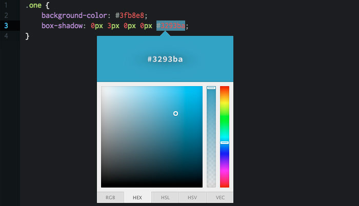
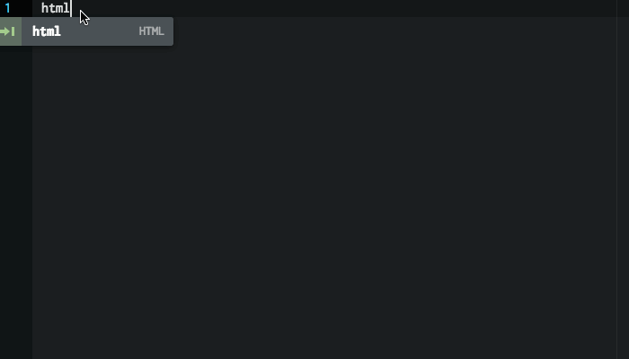
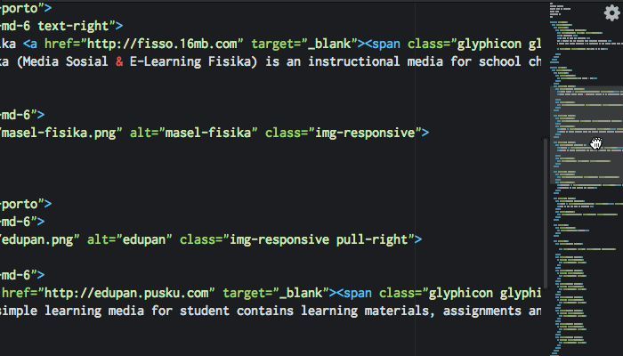
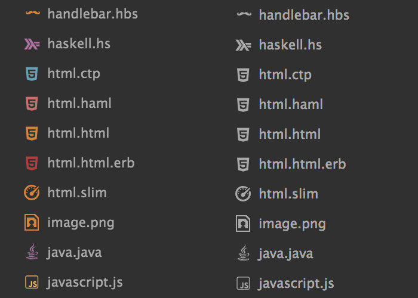

[](https://circleci.com/gh/atom/atom) [](https://travis-ci.org/atom/atom) [](https://ci.appveyor.com/project/Atom/atom)
[](https://david-dm.org/atom/atom)
[](http://atom-slack.herokuapp.com/)

Atom is a hackable text editor for the 21st century, built on [Electron](https://github.com/atom/electron), and based on everything we love about our favorite editors. We designed it to be deeply customizable, but still approachable using the default configuration.

Visit [atom.io](https://atom.io) to learn more or visit the [Atom forum](https://discuss.atom.io).

Follow [@AtomEditor](https://twitter.com/atomeditor) on Twitter for important
announcements.

This project adheres to the Contributor Covenant [code of conduct](CODE_OF_CONDUCT.md).
By participating, you are expected to uphold this code. Please report unacceptable behavior to atom@github.com.

## Documentation

If you want to read about using Atom or developing packages in Atom, the [Atom Flight Manual](http://flight-manual.atom.io) is free and available online. You can find the source to the manual in [atom/flight-manual.atom.io](https://github.com/atom/flight-manual.atom.io).

The [API reference](https://atom.io/docs/api) for developing packages is also documented on Atom.io.

## Installing

### Prerequisites
- [Git](https://git-scm.com/)

### macOS

Download the latest [Atom release](https://github.com/atom/atom/releases/latest).

Atom will automatically update when a new release is available.

### Windows

Download the latest [AtomSetup.exe installer](https://github.com/atom/atom/releases/latest).

Atom will automatically update when a new release is available.

You can also download an `atom-windows.zip` file from the [releases page](https://github.com/atom/atom/releases/latest).
The `.zip` version will not automatically update.

Using [chocolatey](https://chocolatey.org/)? Run `cinst Atom` to install
the latest version of Atom.

### Debian Linux (Ubuntu)

Currently only a 64-bit version is available.

1. Download `atom-amd64.deb` from the [Atom releases page](https://github.com/atom/atom/releases/latest).
2. Run `sudo dpkg --install atom-amd64.deb` on the downloaded package.
3. Launch Atom using the installed `atom` command.

The Linux version does not currently automatically update so you will need to
repeat these steps to upgrade to future releases.

### Red Hat Linux (Fedora 21 and under, CentOS, Red Hat)

Currently only a 64-bit version is available.

1. Download `atom.x86_64.rpm` from the [Atom releases page](https://github.com/atom/atom/releases/latest).
2. Run `sudo yum localinstall atom.x86_64.rpm` on the downloaded package.
3. Launch Atom using the installed `atom` command.

The Linux version does not currently automatically update so you will need to
repeat these steps to upgrade to future releases.

### Fedora 22+

Currently only a 64-bit version is available.

1. Download `atom.x86_64.rpm` from the [Atom releases page](https://github.com/atom/atom/releases/latest).
2. Run `sudo dnf install ./atom.x86_64.rpm` on the downloaded package.
3. Launch Atom using the installed `atom` command.

The Linux version does not currently automatically update so you will need to
repeat these steps to upgrade to future releases.

### Archive extraction

An archive is available for people who don't want to install `atom` as root.

This version enables you to install multiple Atom versions in parallel. It has been built on Ubuntu 64-bit,
but should be compatible with other Linux distributions.

1. Install dependencies (on Ubuntu): `sudo apt install git gconf2 gconf-service libgtk2.0-0 libudev1 libgcrypt20
libnotify4 libxtst6 libnss3 python gvfs-bin xdg-utils libcap2`
2. Download `atom-amd64.tar.gz` from the [Atom releases page](https://github.com/atom/atom/releases/latest).
3. Run `tar xf atom-amd64.tar.gz` in the directory where you want to extract the Atom folder.
4. Launch Atom using the installed `atom` command from the newly extracted directory.

The Linux version does not currently automatically update so you will need to
repeat these steps to upgrade to future releases.

### Archlinux

#### Install by pacman
> sudo pacman -S atom

#### Manually
1. Extract package to `/opt`
> tar -xf atom-amd64.tar.gz -C /opt

2. Add desktop shortcuts, `atom.desktop`
```
[Desktop Entry]
Version=1.10.2
Type=Application
Name=Atom
GenericName=Text Editor
Comment=Sophisticated text editor for code, markup and prose
Exec=/opt/atom-1.10.2-amd64/atom %F
Terminal=false
MimeType=text/plain;
Icon=atom
Categories=TextEditor;Development;
StartupNotify=true
Actions=Window;Document;

[Desktop Action Window]
Name=New Window
Exec=/opt/atom-1.10.2-amd64/atom -n
OnlyShowIn=Unity;

[Desktop Action Document]
Name=New File
Exec=/opt/atom-1.10.2-amd64/atom --command new_file
OnlyShowIn=Unity;
```

## Building

* [Linux](./docs/build-instructions/linux.md)
* [macOS](./docs/build-instructions/macos.md)
* [FreeBSD](./docs/build-instructions/freebsd.md)
* [Windows](./docs/build-instructions/windows.md)

# Plugins for Atom

## Color Picker

As the name implies, this package lets you pick colors, and it is as easy as a right-click and choosing ‘Color Picker’. Alternatively it can be done by pressing CMD/CTRL+SHIFT+C. Color Picker works if your cursor is on the text on CSS/SASS/LESS files that contain one of the following color formats: HEX, HEXa, RGB, RGBa, HSL, HSLa, HSV, HSVa, VEC3 and VEC4, or color variable on SASS or LESS. It also has the ability to convert between the formats.


## Emmet

Emmet seems to be a plugin that you need to install, whatever your text editor environment is. The main features of Emmet such as expanding abbreviations and wrapping with abbreviations, allow you to work quickly when writing HTML, CSS, Sass / SCSS and LESS syntaxes. For example, in HTML, type p>a.mylink then tap on TAB key to get a complete HTML tag <p><a href class="mylink"></a></p>. The Cheat Sheet will helps you to quickly learn Emmet’s abbreviation syntax.


## Minimap

If you are accustomed to Sublime Text, you may be familiar with the mini preview on the right side window. That feature is useful to quickly scroll through source codes too long for the window height. With Minimap, you get this for Atom. You can even set the position to be on the left or right, turn on/off code highlights, and more. Minimap even comes with some plugins to extend its functionality, such as color highlighter.


## Beautify

Beautify will turn your messy code neater and more readable. It has great support for programming languages, such as HTML, CSS, JavaScript, PHP, Python, Ruby, Java, C, C ++, C #, Objective-C, CoffeeScript, typescript, and SQL. After installing this package, to run it, just right-click and choose ‘Beautify editor contents’, or via Packages > Atom Beautify > Beautify.


## Atom Linter

Atom Linter comes as a ‘house’ of linting plugins for major languages, providing the top level API for linters. There are available linters for JavaScript, CoffeeScript, CSS / SASS / SCSS / LESS / STYLUS, Ruby, Python. In one language there are can be more one plugin available, such as JSHint, JSCS and JSXHint for JavaScript.

After installing this main package, you need to install the specific linter for language you work on, for example if you are on JavaScript and choose JSHint for linter then you can install it by running $ apm install linter-jshint on Terminal.

## File Icons

File Icons add icons to a filename based on the corresponding file type. It will add visual improvements when you open a file on tab or on tree view. The file icons are customizable: you can add your own icon and change the color through the LESS files in the packages/file-icons/styles directory. The default icon comes in 8 colors and 3 variants (light, medium and dark).



## JavaScript Snippets

JavaScript Snippets lets you quickly write a portion of JS source code. With defined abbreviation you don’t need to write code word for word, for instance just type cl to make console.log and gi for getElementById. This functionality is similiar to Emmet, but it runs on JavaScript code. This Atom package provides many of the JavaScript syntax like the function, the console, and the loop.


## CSS Comb

CSS Comb makes your stylesheet code formatted consistently, looking neat and beautiful. You can use pre-made sorting preferences based on Yandex, Zen, or CSSComb itself, or you can even use your own preference to make sorting rules. After installing this package, the sorting job can be done by pressing CTRL + ALT + C or accessed from the context menu via Packages > CSS comb > Comb.


## Git Plus

Git Plus allows you to work with Git without leaving Atom editor. Within the editor you are able to make a Git commit, checkout, push/pull, diff and other git commands. You need to setup your user.name and user.email on your git config file to make all functions work. To access all git command, open the palette with CMD + SHIFT + H or choose Package > Git Plus.


## Remote Edit

Remote Edit helps you to see and edit your remote files without leaving the editor or with the use of other ftp applications. To start, firstly create a new host, then add via menu Packages > Remote Edit > Add New Host and insert your login information. Now you can browse to your remote files, use CTRL + ALT + B to browse registered host and see the files.


## atom-django

Build Django apps faster with Atom.

## markdown-themeable-pdf

This Atom package converts / prints / exports your markdown file simple and pretty to PDF, HTML, JPEG or PNG format.
The package was created at the beginning to help in the daily work with manuals for customers. Many people are not familiar with Markdown and they will now receive a well-formatted PDF from their developers. Important here is that the document looks good and professional. This Atom package tries to ask about this task.

## Markdown Preview Plus (MPP)

Markdown Preview Plus (MPP) is a fork of Markdown Preview that provides a real-time preview of markdown documents.

## platformio-ide-terminal

A terminal package for Atom, complete with themes, API and more for PlatformIO IDE.

## pdf-view

Adds support for viewing PDF files in Atom. Powered by PDF.js

## markdown-toc

Generate TOC (table of contents) of headlines from parsed markdown file.


